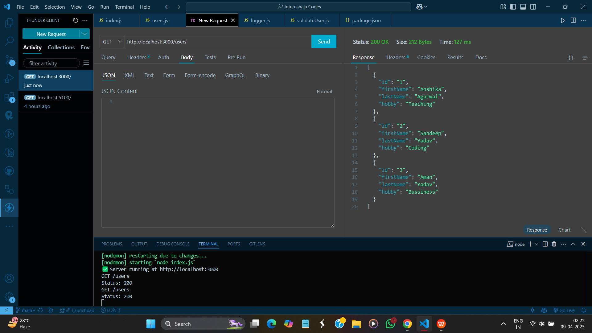
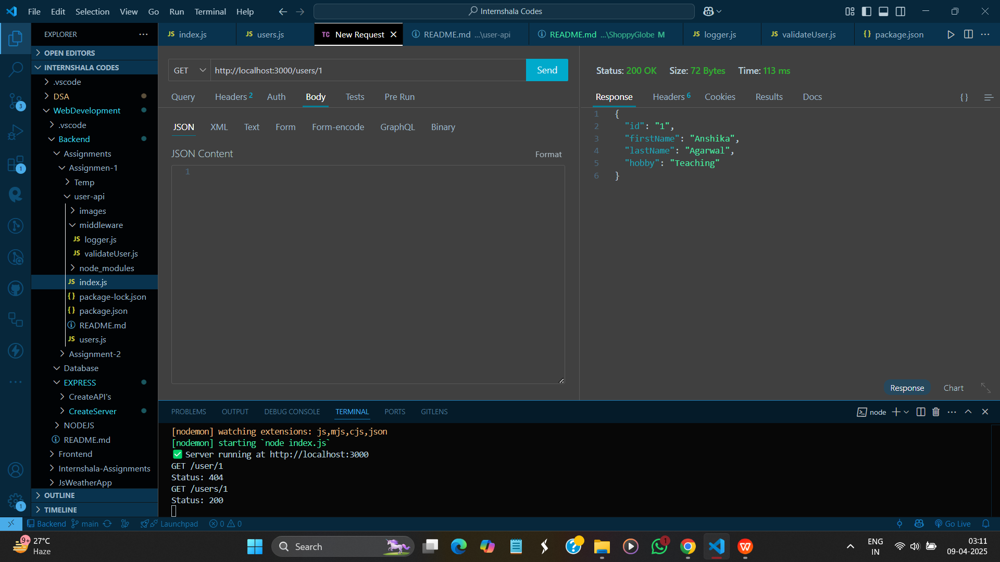
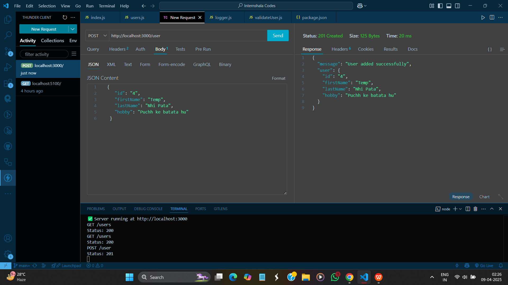

# 📦 User Management RESTful API

A simple Node.js + Express-based REST API to manage a list of users.

---

## 📚 Features

- ✅ Fetch all users
- ✅ Fetch user by ID
- ✅ Add a new user
- ✅ Update an existing user
- ✅ Delete a user
- ✅ Request logging using middleware
- ✅ Input validation for POST and PUT routes
- ✅ Proper error handling and status codes

---

## 🛠️ Technologies Used

- Node.js
- Express.js
- Middleware
- In-memory data storage (array)
- Thunder Client (for testing)

---

## 📂 Project Structure

```sh
user-api/
├── index.js                  # Main server file
├── users.js                  # In-memory user data
├── middleware/
│   ├── logger.js             # Logs method, URL, status
│   └── validateUser.js       # Validates required fields
├── package.json
└── README.md
```

## 🚀 Installation & Running

1. Clone this repo or download the zip.
2. Navigate to the project folder:

```bash
cd user-api


2. Install dependencies

```sh
npm install
```

3. Start the development server

```sh
node index.js
```
(Or use nodemon index.js if installed globally for auto-reloading)

## 🧪 API Endpoints

### ➕ POST /user — Add a new user

- Body: 

``` sh 
{
  "id": "2",
  "firstName": "Sandeep",
  "lastName": "Yadav",
  "hobby": "Coding"
}
```
- ✅ Returns 201 Created

## 📥 GET /users — Get all users

- ✅ Returns an array of user objects

## 📥 GET /users/:id — Get user by ID

- ✅ Returns user object if found

- ❌ Returns 404 if not found

## ✏️ PUT /user/:id — Update a user
 - Body: 

 ``` sh 
 {
  "firstName": "Updated",
  "lastName": "Name",
  "hobby": "Updated Hobby"
}

 ```

 - ✅ Returns updated user if found

 - ❌ Returns 404 if ID not found

 ## ❌ DELETE /user/:id — Delete a user

 - ✅ Returns deleted user info

 - ❌ Returns 404 if ID not found

## 📸 API Testing Screenshots

### 1. ✅ GET /users — Fetch all users  


### 2. ✅ GET /users/:id — Fetch user by ID  


### 3. ✅ POST /user — Add new user  


### 4. ✅ PUT /user/:id — Update existing user by ID  


### 5. ✅ DELETE /user/:id — Delete user  


 ## 🙌 Author
Sandeep Yadav
B.Tech CSE | Internshala Assignment