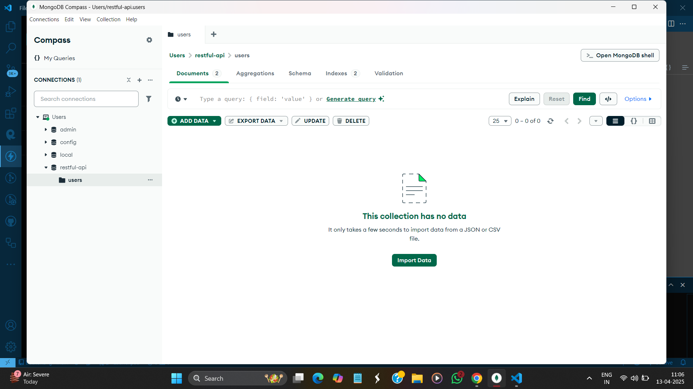
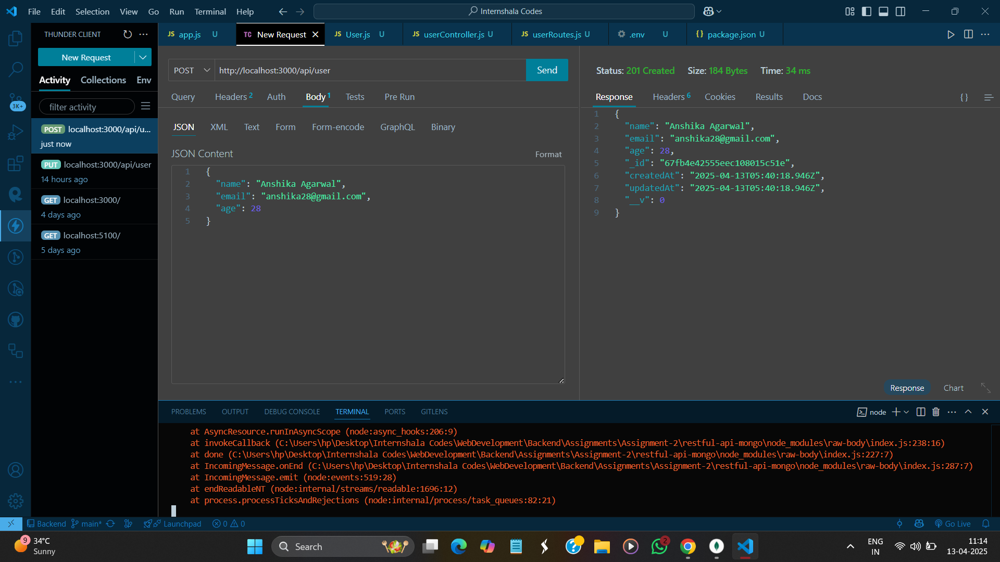
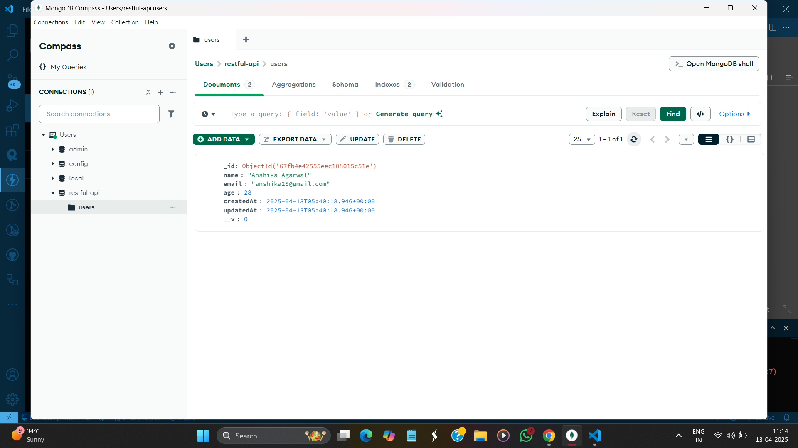
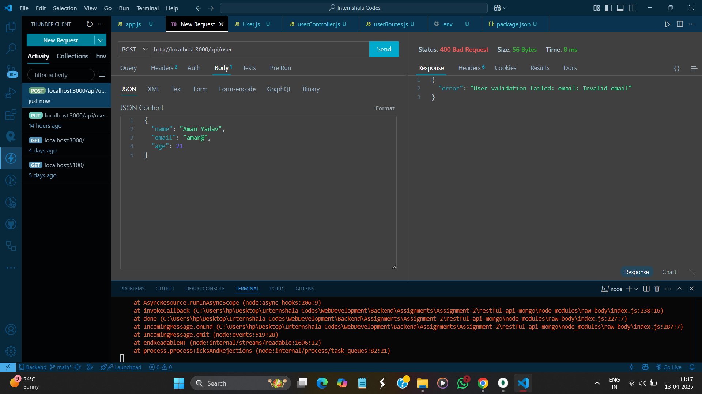
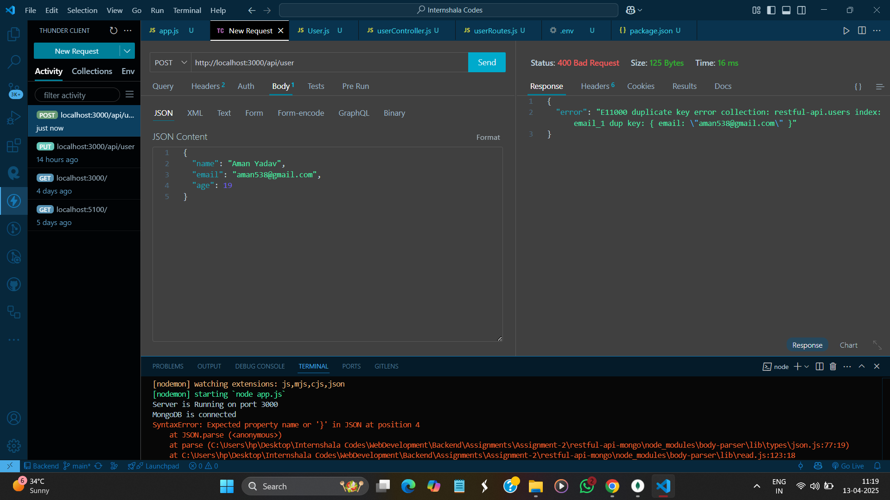
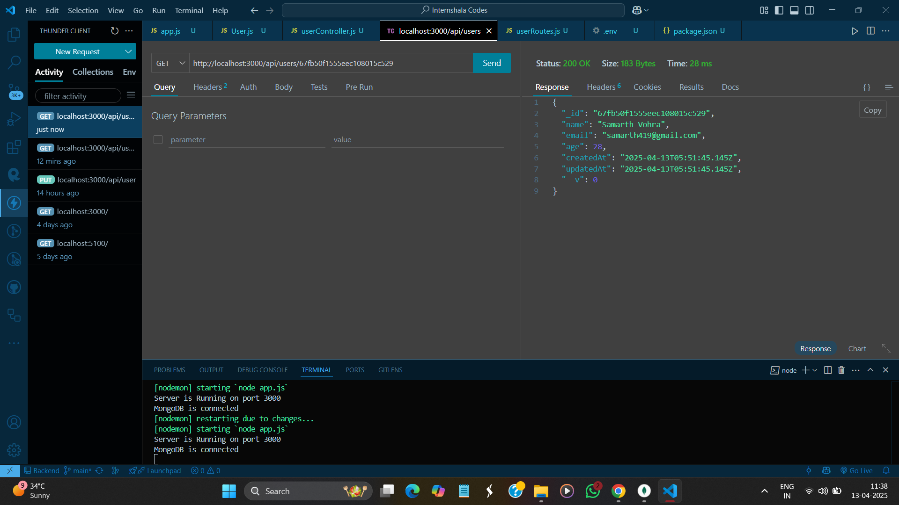
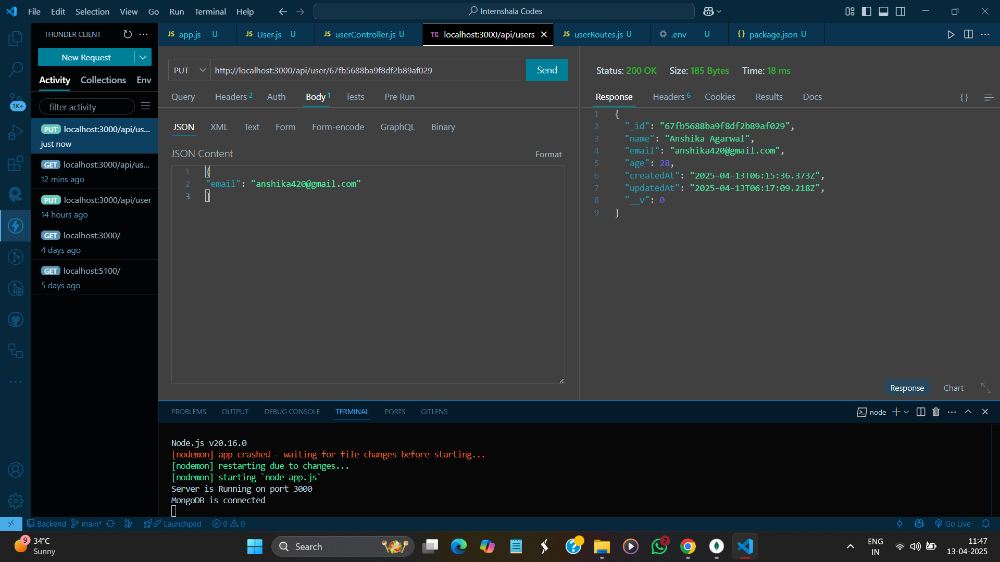
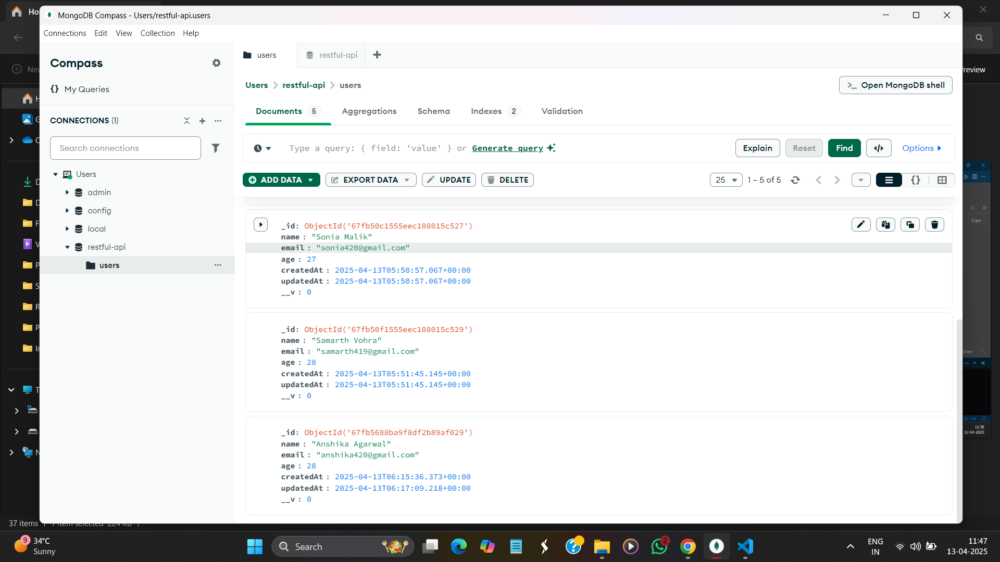
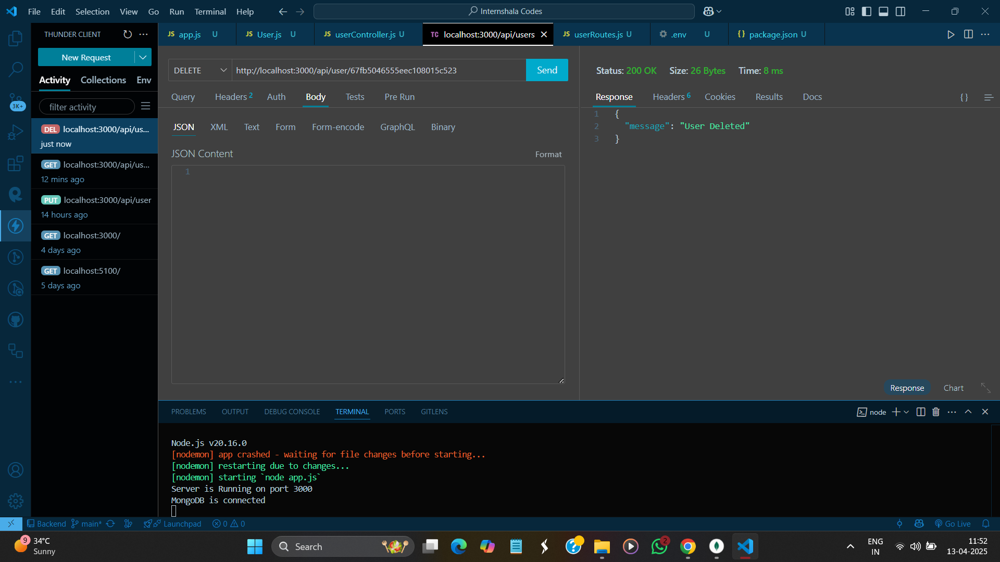

# 📦 User Management RESTful API with MongoDB

A simple RESTful API built with Node.js, Express, and MongoDB using Mongoose to manage user data.

## GitHub Repo Link 
```sh
https://github.com/SandyBhai03/BACKEND/tree/main/Assignments/Assignment-2/restful-api-mongo
```
---

## 📚 Features

- ✅ MongoDB Integration using Mongoose

- ✅ Schema validation (email, required fields)

- ✅ Fetch all users

- ✅ Fetch user by ID

- ✅ Add a new user

- ✅ Update an existing user

- ✅ Delete a user

- ✅ Request logging using middleware

- ✅ Proper error handling and status codes

---

## 🛠️ Technologies Used

- Node.js
- Express.js
- MongoDB (Compass for GUI)
- Mongoose ODM
- Thunder Client (for API testing)

---

## 📂 Folder Structure

```sh
restful-api-mongo/
├── app.js                   # Main server file
├── models/
│   └── userModel.js         # Mongoose schema and model
├── controllers/
│   └── userController.js    # CRUD logic
├── routes/
│   └── userRoutes.js        # API routes
├── middleware/
│   └── logger.js            # Logs requests
├── .env                     # MongoDB connection string
├── package.json
└── README.md
```

## 🚀 Installation & Running

1. Clone this repo or download the zip.

```sh 
https://github.com/SandyBhai03/BACKEND.git
``` 

2. Navigate to the project folder:

```sh 
cd Assignments/Assignment-2/restful-api-mongo
```

2. Install dependencies

```sh
npm install
```
3. Create a .env file and add your MongoDB URI:

```sh
MONGO_URI=mongodb://127.0.0.1:27017/restful-api
```
4. Start the development server

```sh
node app.js
```
(Or use nodemon index.js if installed globally for auto-reloading)

## 🧪 API Endpoints

### ➕ POST /api/user — Add a new user

- json: 

``` sh 
{
  "name": "Sandeep Yadav",
  "email": "sandeep@example.com",
  "age": 22
}
```
- ✅ Returns 201 Created

## 📥 GET /api/users — Get all users

- ✅ Returns an array of users

## 📥 GET /api/user/:id — Get user by ID

- ✅ Returns user object if found

- ❌ Returns 404 if not found

## ✏️ PUT /api/user/:id — Update a user
 - Body: 

 ``` sh 
 {
  "email": "sandeep420@example.com"
}

 ```

 - ✅ Returns updated user if found

 - ❌ Returns 404 if ID not found

 ## ❌ DELETE /api/user/:id — Delete a user

 - ✅ Deletes the user by ObjectId

 - ✅ Returns deleted user info

 - ❌ Returns 404 if ID not found

## 📸 API Testing Screenshots

## 1. ✅ POST /user — Create new user:

#### i. Empty MongoDB Compass


#### ii. Create user in Thunder Client


#### iii. MongoDB Compass after create new user


#### iv. Email Validation in Thunder Client


#### v. Duplicate Entry Validation in Thunder Client


## 2. ✅ GET /users — Fetch all users: 


## 3. ✅ GET /users/:id — Fetch user by ID  


## 4. ✅ PUT /user/:id — Update existing user by ID  

#### i. Updated email in Thunder Client


#### ii. Updated email in MongoDB Compass


## 5. ✅ DELETE /user/:id — Delete user  
#### i. delete user in Thunder Client


#### ii. delete user in MongoDB Compass


 ## 🙌 Author
Sandeep Yadav
B.Tech CSE | Internshala Assignment